## Anskaffning

Köpte en *Crescent 307 Fashion Line* från Blocket för 200 kronor.

## Demontering

Strippade av det initiala lull-lullet och kikade på lite mer detaljer på
cykeln.

Det mesta verkar halvfunkis i alla fall (inte överdrivet med rost) och
nästa omgång ska jag plocka ner hojen helt och rengöra alla delar.

Att lossa på hjulen kräver väl knappast bild, men det är alltid bra att
memorera befintlig storlek och modell på däcken.

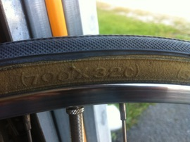

Nästa steg krävde genast lite specialverktyg för att få loss
vevarmspartiet, vilket jag även måste identifiera modell på.

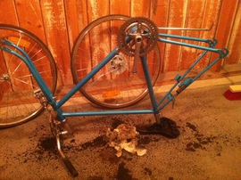

Det visade sig vara ett vevlager med fyrkantsaxel och flera delar bär
märkningen SR, vilket jag gissar betyder tillverkaren SR SunTour.
Förmodligen är det då den japanska JIS-standarden och inte europeisk
ISO. Det ska tydligen gå rätt okej att blanda, om än med lite
fallgropar...

Läs mer om just detta [hos Sheldon Brown](http://sheldonbrown.com/bbtaper.html)!

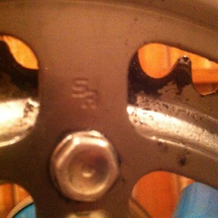

Med en enkel cykelmek-sats från Jula, lyckades jag med vevarmsavdragaren
få loss den ena vevarmen, men stora drevet hänger kvar och gängorna i
Jula-skräpet glappar så fort de utsätts för lite tryck, vilket såklart
krävs för att slita av vevarmen efter alla år. Smörjning och kopparpasta
göra sig icke besvär. Billigt blir snabbt dyrt!

Vevarmspartiet monterar jag av senare, när jag väl fått tag i ett
riktigt verktyg; gummihammaren verkar göra mer skada än nytta.

Sen lossade jag styret, styrstammen och framgaffeln. Ramen blir något
otymplig att jobba med när vevpartiet fortfarande hänger kvar och även
om jag har beställt nytt, så vill jag ju såklart undvika att skada
tänderna på drevet mer än nödvändigt.

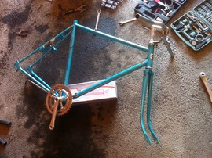

För att lossa på styrstammen och framgaffeln, fick jag leta en stund,
eftersom jag aldrig gjort det förr. Vid första anblick kunde jag heller
inte hitta var jag ens skulle börja, men det sitter ett långt skruvstag
rakt igenom styrstammen, vilket lossas på uppifrån.

Denna lilla nedsänkta skruv var dock igentäckt med lim/plast, vilket jag
fick gröpa ur med en liten kniv. Då blev det genast ganska självklart
hur det hela hängde ihop. Skruven syns på garagebilden lite längre ner
och ligger bredvid styrstammen.

Sen hittade jag en liten kul grej jag inte riktigt vet vad den var till
för...

Bakåt i färdriktningen på kronröret satt en skruv som var monterad
inifrån röret och som i sin tur var lindad runt någon plastvajer som
löpte inuti snedröret hela vägen ner till vevlagerhuset.

Antar att det nog hade något med avrinning att göra, men hur som helst
så slängde jag joxet eftersom jag nog ändå aldrig skulle få för mig att
montera tillbaka det.

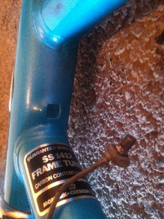

Slänger in en liten garagebild bara för att det är gött!

## Nya delar

- Hjul Cavo singlespeed/fixie, 28"/622mm, flipflop-nav 17T-drev/frikrans
  ([länk](http://shop.duells.se/hjul-cavo-28-622mm-single-speed-149009))
- Fälgband
- Slang Bontrager 700x20-25 Presta-ventil 60 mm
- Däck Continental
- Vevparti standard 170mm, 9/16", 46T
  ([länk](http://shop.duells.se/vevparti-standard-187756))
- Pedaler Cavo singlespeed
- Tåclips Cavo
  ([länk](http://shop.duells.se/taclips-cavo-189884))
- Clipsrem Zefal, svart läder
  ([länk](http://shop.duells.se/clipsrem-zefal-189886))

## Montering

Efter den initiala demonteringen, blev det till följd av familjeliv en
liten paus i bygget och jag kunde avvara max någon kvällstimme i veckan.

Första motståndet bjöd däcken på, då jag blev orolig att hjulen var för
stora. Det var stört omöjligt att kränga på ett av de nya däcken och
jag åkte in till min lokala cykelhandlare, som inte heller lyckades få
på det. I mina arga försök hemma i vardagsrummet lyckades jag såklart
klämma den nya slangen och ge mig själv punktering, innan jag rullat en
meter ens. Cykelhandlarn bjöd dock på ny slang och däcket var av rätt
modell, men just det exemplaret jag hade försökt med var lite väl tight,
så jag fick ett nytt likadant.

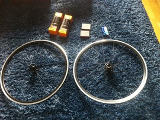

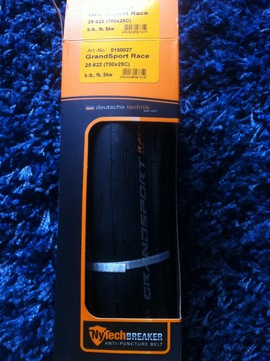

Nästa steg var att hänga på hjulen på ramen. Framhjulet gick bra att
spänna åt, men bakhjulets skruvar gick i bott och klämde aldrig åt
ramens dropout. Det löste jag med en enkel distansbricka.

Vevpartiet var lyckligtvis rätt typ (JIS) och det var bara att banka in
och skruva åt. Pedalerna var även de bara att skruva in och spänna åt.

Sen återmonterade jag styret. Började dock utan handbromsen, men den
tillkom ganska snabbt när jag insåg att jag inte kommer kunna få stopp
på lokomotivet annars.

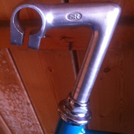

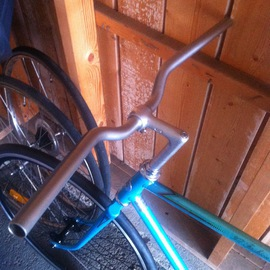

Nu återstår kedjan och handbromsen.

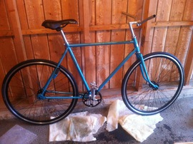

För att få på handbromsen behövde jag plocka ner styrstammen igen för
att vajern skulle ha något att spänna mot. Det syns på de färdiga
bilderna.

Och sist men inte minst - kedjan!

Här gjorde jag bort mig direkt, genom att med kedjebrytaren trycka
igenom en av pinnarna hela vägen. Eftersom jag skulle korta ner kedjan
ca tio länkar, så gjorde det dock inget, eftersom jag kunde pussla ihop
den med de överblivna länkarna.

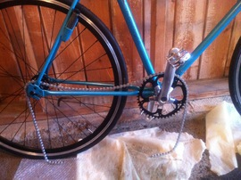

Då så! Kedjan är smörjd och handbromsen är monterad! Jag skruvade snabbt
på tåclipsen och snurrade fast läderremmen på pedalerna.

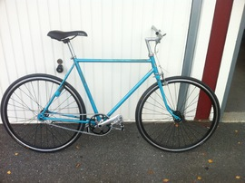

## Resultat

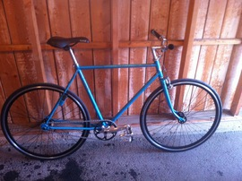

### Kvar att göra

- Tighta kedjan bara liiiite till. Känns inte som den kommer hoppa av, men
  när jag petar på den känns den lite för slapp.
- Framgaffeln glappar lite och jag tror jag måste ta en vända med fasta nyckeln
  och dra åt lite mer.
- ~~Någon typ av tejp eller gummihandtag för styret~~
- Eventuellt byta hela styret till bullhorns.
- Höja sadeln. Tyvärr är den i maxläge nu, så den kommer väl kanske få bytas ut
  på sikt.
- Eventuellt byta handbromsen till en ny. Nuvarande är lite slö och eftersom jag
  inte lärt mig skidda än (fan vad svårt det var!), är det min enda
  livförsäkring.
- Slipa bort det fasta låset, samt parkeringsstödet. Renare look och mindre
  vikt!

## Kostnad

Hela projektet gick på löpande kostnad allteftersom och med tanke på att
jag helt saknade ett garage med verktyg och annat, så är det mycket som
egentligen inte är direkt kopplat till cykeln, men som jag ändå väljer
att ta upp som en del av kostnaden, eftersom jag förmodligen inte köpt
det om det inte vore för cykeln.

### Själva cykeln och dess nya delar

Nya delar beställdes/köptes hos min lokala cykelhandlare, eftersom jag
gillar att stödja lokala förmågor. Nästan alla delar återfinns således i
Duells sortiment. Se ovan under [nya delar](./#nya-delar).

- Grundcykel, 200 kr
- Hjul, 2150 kr
- Fälgband, 100 kr
- Slang, 170 kr
- Däck, 700 kr
- Vevparti, 260 kr
- Pedaler, 370 kr
- Tåclips, 100 kr
- Clipsrem, 100 kr
- Kedja, 100 kr

Deltotal: 4250 kr

### Garage och verktyg

Allt är inköpt på Jula, om inget annat sägs.

#### För ordning och reda:

- Piassavakvast, 70 kr
- Torkrulle (grovt papper), 150 kr
- Sopsäck 125l, 10 kr
- Arbetshandske, 10 kr
- Balja, 40 kr
- Trälåda, 80 kr

Deltotal: 360 kr

#### Verktyg (ej cykelspecifika):

- Stålborste, 10 kr
- Gummihammare, 70 kr
- Dremel 3000, 800 kr
- Blocknyckelsats 12-delar (8-19), 170 kr
- Fettspruta, 180 kr

Deltotal: 1230 kr

#### Cykelprylar:

- Display-/mekställ (inget riktigt ställ, utan mer "hjulupphöjd parkering"), 80
  kr
- Verktygskit (15 delar), 300 kr
- Fotcykelpump, 100 kr
- Fyrkantsvevavdragare (ej Jula), 230kr

Deltotal: 710 kr

#### Förbrukning:

- Smörjfett universal 420ml, 60 kr
- Universalspray 5-56 200ml, 50 kr
- Kopparpasta (spray) 300ml, 100 kr
- Kedjeolja, 110kr

Deltotal: 320 kr

## Länkar, hjälp och inspiration

- Forumet på [Fixedgear.se](http://www.fixedgear.se/)
- Forumet på [HappyMTB](http://www.happymtb.se/)
- Allt du behöver veta om cyklar från den bortgångne
  [Sheldon Brown](http://www.sheldonbrown.com/)
- Bilder från [Fixedgeargallery](http://fixedgeargallery.com/)
- Komponentsökning på [Cyclecomponents](http://www.cyclecomponents.com/),
  [Bikester](http://www.bikester.se/) och [Duells](http://shop.duells.se/)

---

*Östersund, 2015*
